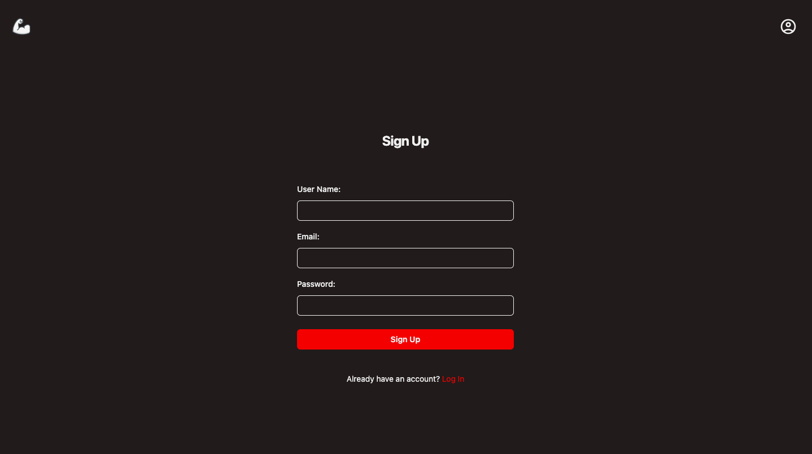
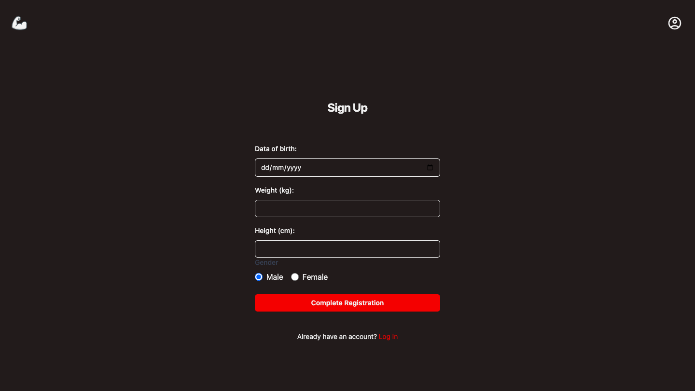
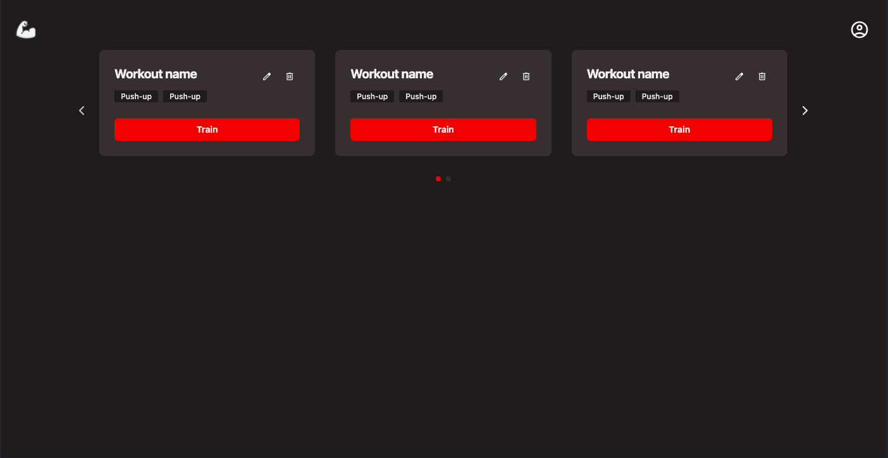

## My Contributions  

I worked on the **frontend** of the project, focusing on building a user-friendly and visually appealing interface. My key contributions include:  

### **Authentication Pages**  
Developed the **Login** and **Sign-Up** pages.  

#### **Sign-Up Page**  
The sign-up process was divided into **two steps** to improve user experience:  

- **Step 1**: Requires **username, email, and password**  
    

- **Step 2**: Asks for **additional user information**  
    

### **Dashboard (Ongoing)**  
Created the **Dashboard page** to display user information and their workouts.  
  

### **High-Fidelity Prototype**  
Designed the **UI/UX prototype** in **Figma** to guide the development process and ensure a smooth user flow.  

- **Solution URL**: [Figma Prototype](https://www.figma.com/proto/kMlTe1PSTkvTohU7atWEUH/MuscleFlow?page-id=30%3A333&node-id=47-734&viewport=45%2C296%2C0.13&t=F3Me7dLEhSMSH4eQ-1&scaling=scale-down&content-scaling=fixed)  

### **Styling with Tailwind CSS**  
Used **Tailwind CSS** to implement a design.  
